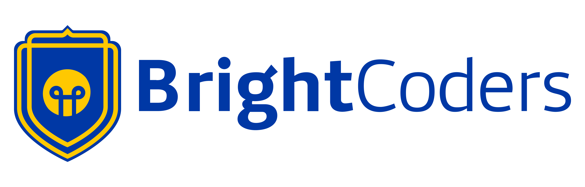

# Reto de diseño web

_**Descripción general:**
Página web replicada bajo la dinámica de trabajo Mob Programming_

## 📋 Tabla de contenido
- Proyecto en GitHub Pages
- Créditos

## 🚀 Proyecto en GitHub Pages
**[Liga de acceso a la página](https://brightcoders-institute.github.io/s1a1-dise-o-web-responsivo-bcdic23-w1-r1-team-5/)**

## Créditos
- **[LuisChavez2023](https://github.com/luischavez2023)**
- **[ErikGmz](https://github.com/ErikGmz)**
- **[alandin1](https://github.com/alandin1)**
- **[luiandre13](https://github.com/luiandre13)**